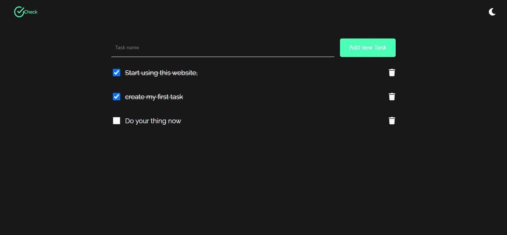

## Check

I made this project because I want to manage some task so I can see all the thing I should
do today, and view by the end of the day if I finish all of them. If you want to manage your
task too, so this is for you, you can use this for free :)

## Want to Contribute to this project ?

- forked the project [Judionit/check](https://github.com/Judionit/check)
- clone your forked project
- Create a branch for your change
- make a pull request
  
That's all folks
Thanks you for reading!!
